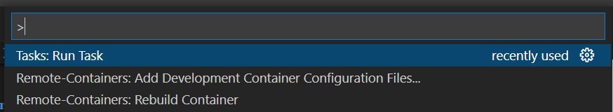
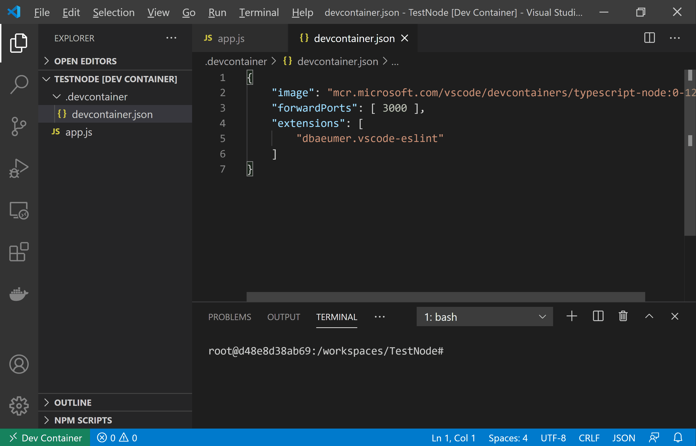

<!-- _footer: 'https://github.com/codebytes/dev-containers' -->

# Dev Containers

A VS Code superpower

---

## Chris Ayers
### Senior Customer Engineer Microsoft

<i class="fa-brands fa-twitter"></i> Twitter: @Chris\_L\_Ayers
<i class="fa-brands fa-mastodon"></i> Mastodon: @Chrisayers@hachyderm.io
<i class="fa-brands fa-linkedin"></i> LinkedIn: - [chris\-l\-ayers](https://linkedin.com/in/chris-l-ayers/)
<i class="fa fa-window-maximize"></i> Blog: [https://chris-ayers\.com/](https://chris-ayers.com/)
<i class="fa-brands fa-github"></i> GitHub: [Codebytes](https://github.com/codebytes)

---

# Agenda

- Prerequisites
- What are Dev Containers?
- How Dev Containers Work?
- Why use Dev Containers?
- How to build a Dev Containers?
  
---

# Prerequisites

- VS Code
- Docker
  - Windows - Docker Desktop 2.0+ / WSL2
  - Mac - Docker Desktop 2.0+
  - Linux - Docker CE/EE 18.06+ / Docker Compose 1.21+
    - (Ubuntu snap not supported)
- VSCode - Remote - Containers Extension

---

# What are Dev Containers?

---

# Dev Containers are:

- Environments that run in a container
- Containers that let you open or mount any folder and still use VS Code UI and tooling
- Places to run Apps, Tools, or Runtimes needed for a project or codebase

---

# How Dev Containers Work

---

# Why use Dev Containers?

- <i class="fa fa-users"></i> Onboard new People
- <i class="fa fa-wrench"></i> Use consistent tooling 
- <i class="fa fa-file-code-o"></i> Use consistent versions
- <i class="fa fa-warning"></i> Reduce System Conflicts
- <i class="fa fa-tasks"></i> Perform Startup Tasks

---

# How do you build a Dev Container?

From the Command Pallet

 

---

# Which Dev Container do I Pick?

 

---

# How Do I Configure it?

---

# DEMO TIME

---

---

# Resources 

## Links

- [https://docs.microsoft.com/en-us/events/learntv/learnlive-iac-and-bicep/](https://docs.microsoft.com/en-us/events/learntv/learnlive-iac-and-bicep/)
- [https://github.com/codebytes](https://github.com/codebytes)

## Chris Ayers 

<i class="fa-brands fa-twitter"></i> Twitter: @Chris\_L\_Ayers
<i class="fa-brands fa-mastodon"></i> Mastodon: @Chrisayers@hachyderm.io
<i class="fa-brands fa-linkedin"></i> LinkedIn: - [chris\-l\-ayers](https://linkedin.com/in/chris-l-ayers/)
<i class="fa fa-window-maximize"></i> Blog: [https://chris-ayers\.com/](https://chris-ayers.com/)
<i class="fa-brands fa-github"></i> GitHub: [Codebytes](https://github.com/codebytes)

