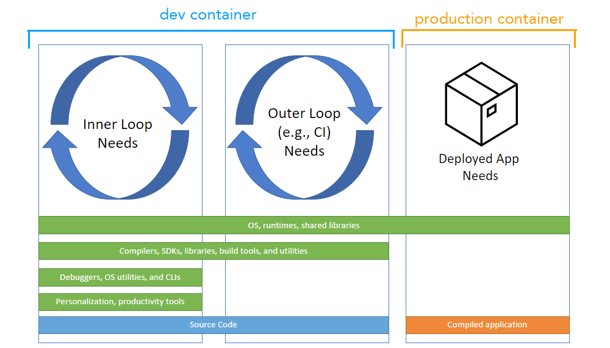
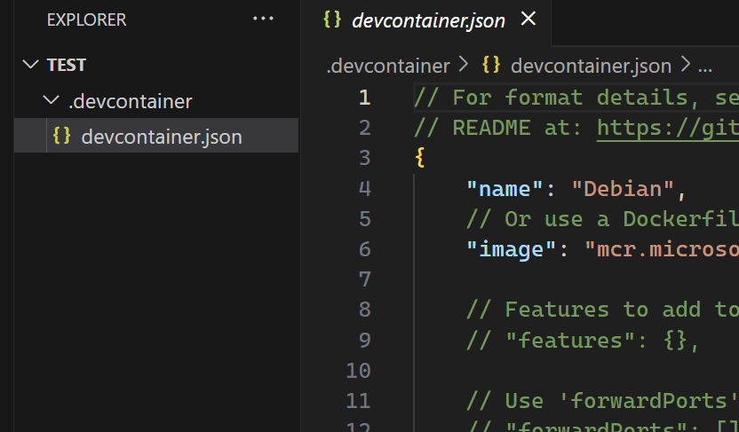
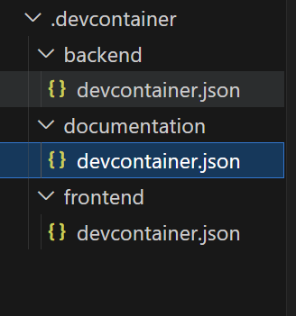
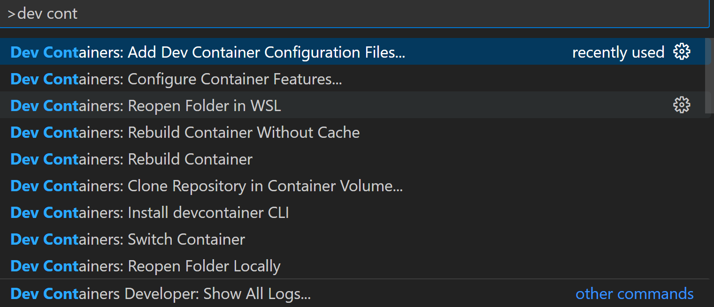
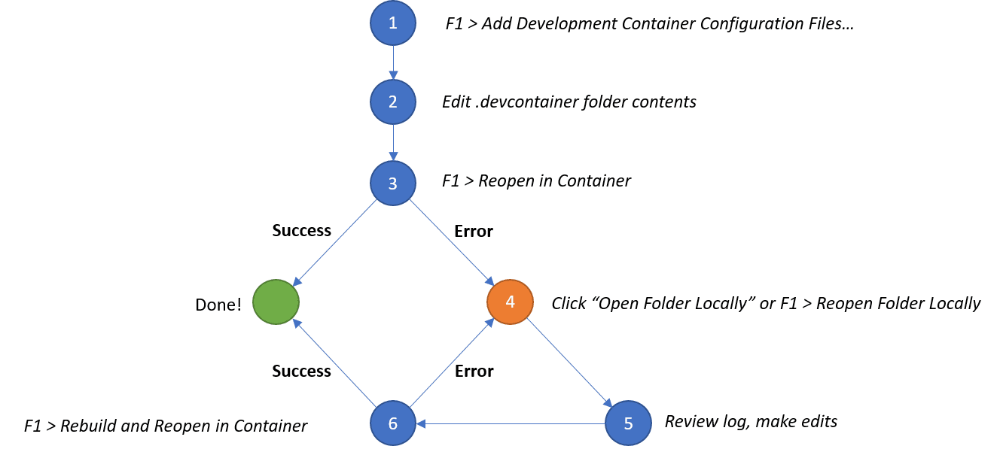
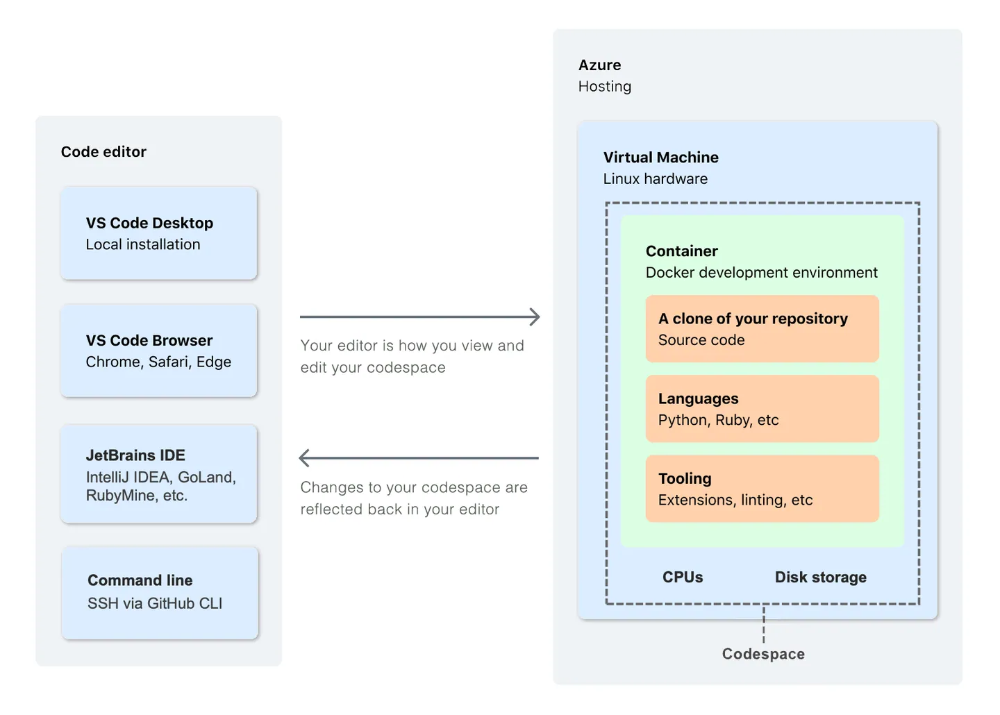
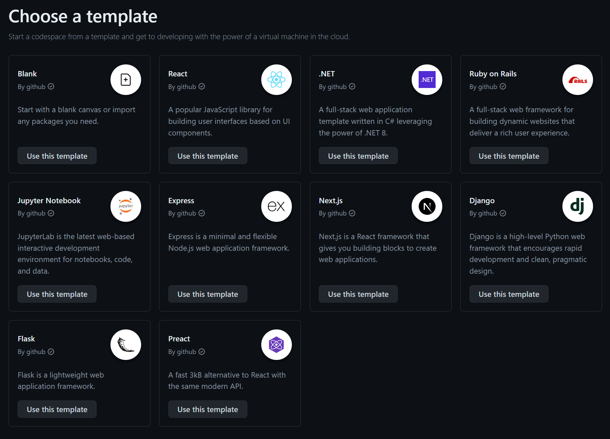

# The Power of Dev Containers and GitHub Codespaces

### From Local Dev to Cloud Ready: Portable Environments with Dev Containers & Codespaces

##  Chris Ayers

<!-- _footer: 'https://github.com/codebytes/dev-containers' -->

---

## Chris Ayers

### Senior Risk SRE Azure CXP AzRel Microsoft

<i class="fa-brands fa-bluesky"></i> BlueSky: [@chris-ayers.com](https://bsky.app/profile/chris-ayers.com)
<i class="fa-brands fa-linkedin"></i> LinkedIn: - [chris\-l\-ayers](https://linkedin.com/in/chris-l-ayers/)
<i class="fa fa-window-maximize"></i> Blog: [https://chris-ayers\.com/](https://chris-ayers.com/)
<i class="fa-brands fa-github"></i> GitHub: [Codebytes](https://github.com/codebytes)
<i class="fa-brands fa-mastodon"></i> Mastodon: @Chrisayers@hachyderm.io
~~<i class="fa-brands fa-twitter"></i> Twitter: @Chris_L_Ayers~~

---

# Agenda

- Prerequisites
- What Are Dev Containers?
- Why Use Dev Containers?
- How Dev Containers Work
- How to Build a Dev Container
- Templates, Features, Customization
- GitHub Codespaces
- Demo
  
---

# Prerequisites

## DevContainers

- VSCode
  - Dev Containers Extension
  - GitHub Codespaces Extension
- IntelliJ IDEA

## Docker

- Docker installed locally
- Remote Docker host (optional for remote container execution)
- Other Docker compliant CLIs, installed locally or remotely

## GitHub Codespaces Requirement

- GitHub Account
- GitHub Codespaces

---

# What are Dev Containers?

- Environments that run in a container
- Containers that let you open or mount any folder and still use VS Code UI and tooling
- Places to run Apps, Tools, or Runtimes needed for a project or codebase
- [Containers.dev](https://containers.dev/) - An open specification for enriching containers with development specific content and settings.

---

# Why use Dev Containers?

- <i class="fa fa-users"></i> Onboard new People
- <i class="fa fa-wrench"></i> Use consistent tooling
- <i class="fa fa-file-code-o"></i> Use consistent versions
- <i class="fa fa-warning"></i> Reduce System Conflicts
- <i class="fa fa-tasks"></i> Perform Startup Tasks
<i class="fa fa-shield"></i> Improve security via isolation

---

# Inner and Outer Loops

---

# How Dev Containers Work

Your editor talks to a containerized environment with all the dependencies, so your local system stays clean.

---

# Where do Dev Containers Live?

---

# Multiple Dev Container Configurations

Tooling supports multiple devcontainers.
Each one should be in its own subdirectory at:

.devcontainer/SUBDIRECTORY/devcontainer.json.

---

# How do you build a Dev Container?

From the Command Pallet

---

# Which Dev Container do I Pick?

---

# Templates

Full List: [https://containers.dev/templates](https://containers.dev/templates)

- Base (Alpine, Debian, Ubuntu)
- Language Based (C#, C++, Java, Go, Node, Python, Rust, Ruby, PHP)
- Tool Focused (Markdown, Kubernetes, Docker, Jekyll)

---

# Customizations

- Features
- Extensions
- Settings
- Startup Tasks
- Networking

---

# Features

Full list here: [https://containers.dev/features](https://containers.dev/features)

- CLIs (azure, gh, gcp, aws)
- Tools (Terraform, kubernetes...)
- Runtimes (Node, Python, Go, Java, .NET, PHP, Ruby, Rust, C/C++, C#)

---

# Configuration Loop

---

# GitHub Codespaces

- Don't need to worry about Docker Desktop
- VSCode, IntelliJ, Browser
- From 2 cores up to 16 cores w/ 64GB of RAM
- Default universal DevContainers
- Codespaces only offers Linux as the OS and x86_64 as the Architecture

---

# GitHub Codespaces Architecture

---

# GitHub Codespace templates

[https://github.com/codespaces/templates](https://github.com/codespaces/templates)

---

# DEMO TIME

---

---

# Resources

## Links

- [Dev Container Templates](https://containers.dev/templates)
- [Dev Container Features](https://containers.dev/features)
- [Dev Containers Tutorial](https://code.visualstudio.com/docs/devcontainers/tutorial)
- [Beginner's Series to Dev Containers](https://learn.microsoft.com/en-us/shows/beginners-series-to-dev-containers/)
- [https://github.com/codebytes](https://github.com/codebytes)

## Chris Ayers

<i class="fa-brands fa-bluesky"></i> BlueSky: [@chris-ayers.com](https://bsky.app/profile/chris-ayers.com)
<i class="fa-brands fa-linkedin"></i> LinkedIn: - [chris\-l\-ayers](https://linkedin.com/in/chris-l-ayers/)
<i class="fa fa-window-maximize"></i> Blog: [https://chris-ayers\.com/](https://chris-ayers.com/)
<i class="fa-brands fa-github"></i> GitHub: [Codebytes](https://github.com/codebytes)
<i class="fa-brands fa-mastodon"></i> Mastodon: @Chrisayers@hachyderm.io
~~<i class="fa-brands fa-twitter"></i> Twitter: @Chris_L_Ayers~~

